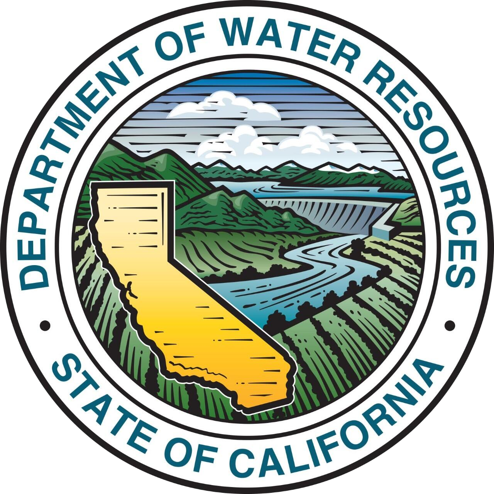

# DWR Publication Inventory
  

`dwrpubs` builds a curated inventory of peer-reviewed publications that the [California Department of Water Resources](https://water.ca.gov) supported through funding or authorship. The package pulls together manual [DOI](https://www.doi.org/the-identifier/what-is-a-doi/) curation, [Crossref](https://www.crossref.org) and [OpenAlex](https://openalex.org) harvesting, metadata normalization, and discipline tagging so staff can publish consistent peer-reviewed manuscript inventories for reports, dashboards, and other communications. Large language models (LLMs) are used to standardize and classify unstructured text.

## At a Glance
- **Inputs**: DOI lists, Crossref metadata API results, OpenAlex metadata API results, and staff rosters for attribution.
- **Processing**: normalization pipelines for authors, affiliations, and contribution flags plus user-guided overrides.
- **Classification**: LLM-powered discipline tagging against a user-supplied taxonomy.
- **Outputs**: ready-to-use datasets and a human-readable, denormalized inventory CSV file.

## Quick Start
_Forthcoming._

## Data Refresh Workflow
_Forthcoming._

## LLM-Assisted Processing
- **Affiliation cleanup**: [`data-raw/all_metadata.R`](data-raw/all_metadata.R) optionally calls LLMs to canonicalize institution names pulled from Crossref and OpenAlex, falling back to cached lookups when API credentials are unavailable or the user does not wish to generate a new lookup object.
- **Discipline tagging**: [`data-raw/classified_inventory.R`](data-raw/classified_inventory.R) batches article titles and abstracts through Gemini, seeding the prompt with the user-maintained taxonomy (`data/disciplines_taxonomy.rda`) so that classifications adhere to that controlled vocabulary—a lightweight RAG pattern.

## Roadmap for Future Work
### Documentation
- [ ] Add quick-start instructions to this README.
- [ ] Document the use and expansion of manual overrides in automated processing scripts.
- [ ] Flesh out [`vignettes/generate_inventory.qmd`](vignettes/generate_inventory.qmd) with an end-to-end workflow walkthrough.
- [ ] Add package-level documentation that introduces the data objects and exported helpers.

### Reliability and Automation
- [ ] Create automated tests for package functions.
- [ ] Wrap the [`data-raw/`](data-raw/) scripts in a reproducible refresh pipeline that handles API credentials.
- [ ] Configure CI to run `R CMD check` and guard the data and package refresh process.
- [ ] Add README on LLMs for unstructured text parsing and classification, including commentary on non-deterministic behavior.

### Products
- [ ] Create a visualization dashboard, static figures, and other communications products.

## License
Released under the [MIT License](LICENSE.md).
